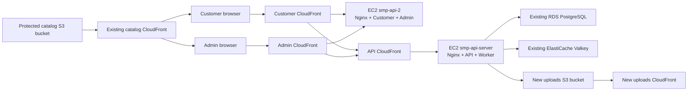

# SMP Initial AWS Production Deployment Design

Date: 2026-07-17  
AWS account: `651863679421`  
Primary region: `ap-south-1`  
Approved approach: Existing EC2 instances with Docker, ECR, Nginx, and CloudFront

## 1. Purpose

Deploy the SMP monorepo's customer website, admin dashboard, backend API, and
background worker to AWS while reusing the existing PostgreSQL, Valkey, S3, and
CloudFront resources.

This is an initial, cost-optimized production deployment. It prioritizes data
protection, repeatability, least privilege, managed HTTPS entry points, and
operational visibility while avoiding the recurring costs of Fargate, a NAT
Gateway, and an Application Load Balancer.

## 2. Constraints and Success Criteria

### Required outcomes

- Deploy `apps/web`, `apps/admin`, `apps/api`, and `apps/worker`.
- Use AWS-generated CloudFront HTTPS URLs because no custom domain is available.
- Reuse the two existing EC2 instances as the application hosts.
- Reuse the existing RDS PostgreSQL instance and ElastiCache Valkey cluster.
- Preserve the existing RDS data without migrations, resets, seeds, or
  deployment-induced writes.
- Preserve every existing object in the catalog S3 bucket without deletion,
  overwrite, metadata change, or content change.
- Use root only for the initial IAM bootstrap.
- Perform routine deployment through least-privilege roles.
- Keep incremental spend low enough for the initial deployment to use the
  account's remaining AWS promotional credits.

### Deliberate initial-phase limitations

- Each EC2 host is a single failure point.
- The two existing `t3.micro` instances remain at their current size initially.
- There is no multi-instance application tier or automatic horizontal scaling.
- Deployments are initiated manually from the local checkout. Automated
  GitHub-to-AWS deployment is deferred.
- Viewer traffic uses HTTPS to CloudFront. CloudFront reaches the public EC2
  origins over HTTP, with the origin security groups restricted to the
  CloudFront managed prefix list.

## 3. Protected Asset Baseline

### Existing catalog S3 bucket

Bucket:
`smp-prod-images-651863679421-ap-south-1-an`

Baseline captured on 2026-07-17:

- Object count: `255`
- Total bytes: `5,298,735`
- All objects are under `catalog/`.
- Aggregate content SHA-256:
  `dfe52fa9d86c710b9fefd0511d971d5389ca677d41ac6dd387fc0f6df651da23`
- The S3 listing remained stable while the content baseline was calculated.

The aggregate is reproducible: sort objects by UTF-8 key, then append the
eight-byte big-endian key length, key bytes, eight-byte big-endian object size,
and raw SHA-256 content digest for each object to a SHA-256 accumulator.

The existing catalog distribution remains:
`d268wazo8qmwud.cloudfront.net`.

No deployment or runtime role receives `PutObject`, `DeleteObject`,
`DeleteObjectVersion`, or bucket-configuration permissions on this bucket.
Runtime applications do not need direct access to the catalog bucket because
existing database URLs point to the catalog CloudFront distribution.

### Existing RDS instance

Instance: `smp-prod-db`

Baseline captured on 2026-07-17:

- Status: `available`
- Engine: PostgreSQL `18.3`
- Class: `db.t3.micro`
- Storage: `20 GiB` encrypted `gp3`
- Multi-AZ: disabled
- Backup retention: one day
- Automated snapshots: three available
- Manual snapshots: none
- Database connections over the previous seven days: zero
- Configuration SHA-256:
  `e90d32cda06f73cac38cbaa8f6514f6edd28ec596b9d6f9cc438542c7062a7d4`

The database remains outside CloudFormation. CDK references its identifiers and
network properties without importing ownership or introducing replacement risk.

## 4. Architecture

### EC2 service placement

`smp-api-server` runs:

- Nginx origin proxy
- Backend API container on port `4000`
- Worker container without a public listener

`smp-api-2` runs:

- Nginx origin proxy
- Customer Next.js container on port `3000`
- Admin Next.js container on port `3001`

Images are built locally and pulled from ECR. Production compilation does not
run on EC2. Each service has explicit memory limits and a restart policy. A
small monitored swap file provides burst protection but does not replace memory
monitoring or later right-sizing.

## 5. CloudFront and Request Routing

Create separate distributions for:

- Customer website
- Admin dashboard
- Backend API
- New uploads bucket

The customer, admin, and API distributions use the relevant EC2 public DNS name
as a custom origin after a stable Elastic IP is associated with each instance.
Each distribution supplies a fixed origin-routing header. Nginx uses that
header to route to the appropriate local container.

Origin security groups allow port 80 only from the AWS-managed CloudFront
origin-facing prefix list. Direct internet access to the service ports is
denied.

CloudFront behaviors:

- `/_next/static/*` uses an optimized cache policy.
- Customer and admin dynamic requests forward cookies, query strings, and the
  required application headers with caching disabled.
- API requests allow all application HTTP methods and disable caching.
- API forwarding preserves authorization, cookies, query strings, request
  bodies, and the request ID header.

CloudFront outputs provide the final values for:

- `NEXT_PUBLIC_SITE_URL`
- Customer and admin `NEXT_PUBLIC_API_URL`
- API `CORS_ORIGINS`
- `STORAGE_PUBLIC_BASE_URL`
- `NEXT_PUBLIC_STORAGE_PUBLIC_URL`

The incorrect hard-coded catalog CloudFront hostname currently present in the
Next.js configurations is replaced by environment-driven configuration using
the live catalog distribution hostname.

## 6. Storage Isolation

The protected catalog bucket remains unchanged.

A new private uploads bucket is created for future application writes:

- Block Public Access enabled
- Server-side encryption enabled
- Versioning enabled
- CloudFront Origin Access Control used for public delivery
- API runtime role allowed to write only to the designated upload prefixes
- API runtime role denied object deletion
- Lifecycle policies limited to incomplete multipart-upload cleanup and
  noncurrent versions; current objects are not expired automatically

Existing catalog URLs continue to use the current catalog CloudFront
distribution. New uploads use the new uploads CloudFront distribution.

## 7. IAM and Root Exit

Root performs only the IAM bootstrap:

1. Create the least-privilege `smp-deployment-role`.
2. Configure its trust policy for the current account's authenticated principal.
3. Create or authorize creation of the `smp-ec2-runtime-role` and instance
   profile through the deployment role.
4. Assume `smp-deployment-role`.
5. Verify the assumed-role identity before any workload operation.

All subsequent commands use the assumed deployment role.

The deployment role is scoped to:

- The SMP CloudFormation/CDK stacks and CDK bootstrap resources
- SMP-prefixed ECR repositories, Secrets Manager resources, log groups, S3
  upload resources, CloudFront distributions, alarms, and IAM runtime roles
- The two named EC2 instances and their required networking resources
- Snapshot creation and read-only inspection for `smp-prod-db`
- Read-only inspection of the existing RDS, Valkey, catalog S3, and catalog
  CloudFront resources
- `iam:PassRole` only for SMP runtime roles

The EC2 runtime role is scoped to:

- Systems Manager managed-instance permissions
- ECR image pulls
- CloudWatch log and metric publication
- Runtime resolution of the specific SMP Secrets Manager secret
- Required write-only upload prefixes in the new uploads bucket

The application receives no static AWS access keys.

## 8. Secrets

Sensitive environment values are stored as one or more SMP-prefixed Secrets
Manager JSON secrets. The import process reads the approved local environment
keys without echoing their values and never invokes
`secretsmanager:GetSecretValue`.

Runtime commands use `asm-exec` with
`{{resolve:secretsmanager:...}}` references. Secret values exist only in the
child process environment.

Sensitive values include:

- Database connection URL
- Valkey connection URL and credentials
- JWT secrets
- Razorpay credentials and webhook secret
- Any monitoring DSN or provider token

AWS access keys found in local configuration are not migrated. Instance-role
credentials replace them.

## 9. Infrastructure as Code Boundary

CDK manages only new infrastructure:

- ECR repositories and lifecycle policies
- Uploads S3 bucket and CloudFront distribution
- Customer, admin, and API CloudFront distributions
- New security groups and ingress rules
- Secrets Manager secret containers
- CloudWatch log groups, alarms, and dashboards
- Deployment/runtime roles created after the root IAM bootstrap where practical
- Elastic IPs and their associations where CDK can manage them safely

The existing RDS instance, Valkey cluster, catalog bucket, catalog CloudFront
distribution, and EC2 instances are referenced but not imported as owned
CloudFormation resources.

Existing-instance operations that CDK cannot safely own, such as attaching an
instance profile or removing an old launch-wizard security group, use
idempotent AWS CLI commands under the deployment role and are recorded in the
deployment runbook.

The CDK stack uses termination protection. Stateful new resources use retention
policies unless their deletion is explicitly approved.

## 10. EC2 and SSM Bootstrap

After the runtime instance profile is attached:

1. Wait for each instance to appear online in Systems Manager.
2. If an agent is absent, use a temporary EC2 Instance Connect key and a
   source-IP-limited SSH rule to install/start the SSM agent.
3. Remove the temporary SSH rule immediately after SSM is healthy.
4. Remove the existing public SSH rules.
5. Install Docker, the CloudWatch agent, Nginx, `asm-exec`, and the Secrets
   Manager Agent as required.
6. Configure service directories, log rotation, swap, and restart behavior.

The second instance's current public `0.0.0.0/0` SSH rule is treated as a
critical issue and removed as soon as SSM access is proven.

## 11. Build and Release

Add production Dockerfiles for the four applications and a shared
`.dockerignore`.

The Next.js applications use standalone production output appropriate for the
pnpm monorepo. Images include only runtime files and do not contain `.env`
files, source credentials, build caches, or unnecessary workspace artifacts.

Release order:

1. Run repository lint, typecheck, tests, and production builds.
2. Build all four Docker images.
3. Scan the images locally where available.
4. Push immutable commit-based tags to ECR.
5. Record ECR image digests.
6. Pull images onto the EC2 hosts.
7. Start API without executing migrations or seeds.
8. Verify API health and database/Valkey read connectivity.
9. Inspect Redis/BullMQ queue counts.
10. Start the worker only if existing queued jobs are understood and safe.
11. Start customer and admin applications.
12. Verify origin routing.
13. Verify CloudFront endpoints.

The previous image digest remains locally available for rollback.

## 12. Database Safety

After IAM bootstrap and before any workload change, the deployment role:

1. Revalidates the RDS baseline.
2. Creates a timestamped manual snapshot.
3. Waits until the snapshot is `available`.
4. Enables RDS deletion protection.

The deployment does not execute:

- `prisma migrate deploy`
- `prisma migrate dev`
- Prisma seed commands
- The AWS fresh-catalog seed
- Schema-changing SQL
- Data repair or normalization scripts

If the current application build is incompatible with the existing schema, the
API remains stopped and the deployment reports the mismatch. The schema is not
changed automatically.

API health verification may use read-only connectivity checks. No destructive
or mutating application endpoint is called during smoke testing.

## 13. Worker Safety

The worker is deployed in a stopped state.

Before enabling it:

- Verify database and Valkey connectivity.
- Count BullMQ waiting, active, delayed, failed, and paused jobs.
- Review the queue prefixes.
- Confirm that starting processors will not unexpectedly replay historical
  payment, notification, invoice, OTP, low-stock, or expiry jobs.

If queue state is not empty or understood, the worker remains stopped while the
other services can complete deployment.

## 14. Observability and Cost Controls

CloudWatch receives:

- API structured logs
- Worker structured logs
- Customer and admin process logs
- Nginx access/error logs with sensitive headers excluded
- EC2 memory, disk, CPU, and status metrics
- Container restart/failure indicators

Use short log retention appropriate for the initial phase. Create alarms for:

- EC2 instance/system status failure
- Sustained high CPU
- Sustained high memory or swap pressure
- Low disk space
- Repeated container restarts
- API health failure visible at the origin

The initial design does not add Fargate, an ALB, a NAT Gateway, Route 53, ACM,
or an automated deployment pipeline. Incremental recurring charges are limited
primarily to ECR storage, Secrets Manager, CloudWatch usage, CloudFront
traffic, the uploads bucket, and the two already-required public IPv4
addresses.

## 15. Verification Gates

Deployment is not complete until all applicable gates pass:

### Code and images

- Lint passes.
- Typecheck passes.
- Tests pass.
- Production builds pass.
- Four Docker images build successfully.
- ECR image scanning does not report a deployment-blocking critical finding.

### Runtime

- API health returns success through CloudFront.
- Customer routes render through the customer CloudFront URL.
- Admin login route renders through the admin CloudFront URL.
- Existing catalog images load through the unchanged catalog CloudFront URL.
- New upload delivery is tested only with a newly created test key in the new
  uploads bucket.
- Worker readiness passes; worker activation follows the queue-safety gate.

### Protected assets

- Recalculate the protected S3 object count, byte total, and aggregate content
  SHA-256 immediately before deployment.
- Recalculate the same values after deployment.
- Require both values to match the recorded baseline exactly.
- Confirm the RDS instance identifier, resource ID, engine, storage, and status
  match the baseline.
- Confirm the manual pre-deployment snapshot remains available.
- Confirm no migration or seed command ran.

## 16. Failure Handling and Rollback

Any protected-asset mismatch stops the deployment immediately.

Application rollback:

- Stop the failed container.
- Restart the previous immutable image digest.
- Restore the previous Nginx configuration if routing changed.
- Invalidate CloudFront only when stale edge configuration requires it.

Infrastructure rollback:

- Roll back only new SMP CDK resources or their configuration.
- Do not roll back, restore, replace, delete, or modify the existing RDS
  instance.
- Do not modify or restore the protected catalog bucket because the deployment
  never writes to it.

If the worker safety check fails, leave the worker stopped and report the queue
state. This does not block customer, admin, or API verification unless the
application requires an asynchronous operation for the tested path.

## 17. Completion Evidence

The final deployment report must include:

- Assumed deployment-role ARN
- CDK stack outputs
- ECR image tags and digests
- Customer, admin, API, upload, and existing catalog CloudFront URLs
- EC2/SSM online status
- API and frontend smoke-test results
- Worker readiness and queue-safety result
- RDS manual snapshot identifier and status
- Before/after S3 count, bytes, and aggregate SHA-256
- CloudWatch log groups and alarm state
- Any deferred limitation or failed noncritical gate

No completion claim is made while a required gate remains unverified.
