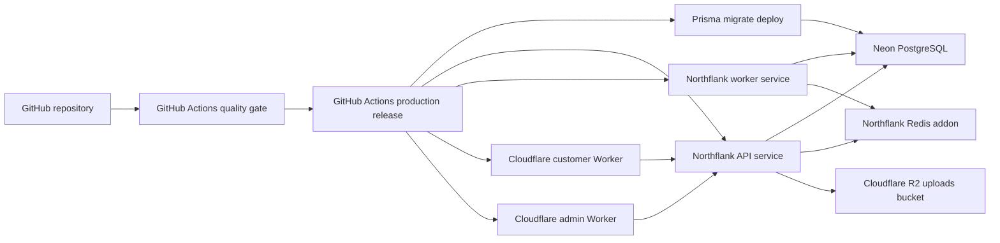

# SMP Provider-Neutral Free Deployment Design

Date: 2026-07-19

## 1. Purpose

Deploy the SMP customer web app, admin web app, API, background worker,
PostgreSQL database, Redis queue store, and object storage without using AWS
infrastructure. The deployment must update automatically from GitHub only after
the repository quality gate passes.

This design supersedes the AWS production deployment design and implementation
plan dated 2026-07-17. It does not authorize deletion or modification of any
existing AWS resource.

## 2. Confirmed Requirements

- Do not deploy any SMP runtime or new infrastructure to AWS.
- Do not migrate the existing AWS PostgreSQL database.
- Do not migrate the existing AWS catalog objects.
- Create a fresh PostgreSQL schema from the committed Prisma migrations.
- Start with no products, warehouses, inventory, orders, customers, or queue
  jobs.
- Retain the existing access-control and fixed catalog taxonomy seed behavior.
- Create the first super-admin only through the explicit bootstrap workflow.
- Deploy production code automatically after successful CI.
- Stop a release when migrations, API health, or worker readiness fails.
- Keep all credentials out of the repository and workflow logs.
- Remain within free service tiers for the initial deployment.

## 3. Target Architecture

### Provider allocation

| Surface | Provider | Production resource |
| --- | --- | --- |
| `apps/web` | Cloudflare Workers with OpenNext | `smp-customer-web` |
| `apps/admin` | Cloudflare Workers with OpenNext | `smp-admin-web` |
| `apps/api` | Northflank combined service | `smp-api` |
| `apps/worker` | Northflank combined service | `smp-worker` |
| PostgreSQL | Neon Free, PostgreSQL 18 | `smp-production` |
| Redis | Northflank free database addon | `smp-redis` |
| Uploads | Cloudflare R2 Standard storage | `smp-production-uploads` |
| CI/CD | GitHub Actions | repository workflows |

Northflank's two free services are reserved for the API and worker. Its one
free database is reserved for Redis because BullMQ continuously uses Redis and
is not a good fit for request-metered free Redis services. Neon provides the
separate PostgreSQL database.

## 4. Repository Deliverables

### API and worker containers

Add production Dockerfiles built from the monorepo root:

- `infra/docker/api.Dockerfile`
- `infra/docker/worker.Dockerfile`

Each image must:

- use Node.js 22;
- use Corepack and pnpm 9.15.4;
- install from `pnpm-lock.yaml` with `--frozen-lockfile`;
- build only the application and its workspace dependencies;
- generate the Prisma client where the application requires it;
- run as a non-root user;
- contain no source `.env` file or build-time secret;
- expose only the API port for the API image;
- run the existing worker preflight before starting the worker.

Docker build validation must be runnable locally without provider credentials.

### Cloudflare Next.js packaging

Add `@opennextjs/cloudflare` and Wrangler 4 to both Next.js applications. Each
application receives its own:

- `open-next.config.ts`;
- `wrangler.jsonc`;
- preview and deployment scripts.

The Wrangler configuration must:

- use a current compatibility date;
- enable `nodejs_compat`;
- enable observability;
- keep secrets out of version control;
- use a distinct Worker name;
- point to the OpenNext worker and asset output.

Both applications continue using their existing server-side API proxy so the
browser does not receive internal service credentials. The public API origin is
provided as a deployment environment variable.

### Provider-neutral storage

Retain the existing `@aws-sdk/client-s3` client because Cloudflare R2 supports
the S3 API. This dependency does not require AWS infrastructure.

Configure the API with:

- `STORAGE_PROVIDER=s3`;
- the R2 S3 endpoint;
- `S3_REGION=auto`;
- an R2 access-key pair supplied by Northflank secrets;
- the R2 bucket name;
- the public R2 custom-domain or public development URL.

The production environment must never use local filesystem uploads.

### Northflank configuration

Document and version the exact Northflank service settings:

- repository and `main` branch;
- monorepo-root Docker build context;
- API and worker Dockerfile paths;
- API public port and health endpoint;
- worker start command and readiness command;
- shared secret group names;
- Redis addon connection injection;
- deployment disabled until GitHub Actions triggers an approved release.

The GitHub workflow triggers Northflank builds through authenticated API calls
and waits for terminal status. The API must pass `/api/v1/health` before the
worker and frontends are considered released.

## 5. Fresh Database Initialization

The new Neon project starts empty. No `pg_dump`, `pg_restore`, logical
replication, AWS DMS, or catalog import is used.

The one-time bootstrap sequence is:

1. Create the Neon PostgreSQL 18 project.
2. Run `prisma migrate deploy` using the direct, unpooled Neon connection.
3. Run the existing seed once with explicit super-admin bootstrap variables.
4. Verify roles, permissions, the super-admin, fixed categories, and fixed
   brands.
5. Verify that product and warehouse counts are zero.

The normal production release runs `prisma migrate deploy` but never runs the
seed. Re-running the seed during every deployment could change catalog taxonomy
or rotate the seeded super-admin password, so it remains a manual bootstrap
operation.

Runtime database traffic may use Neon's pooled connection. Schema migration and
bootstrap operations use the direct connection.

## 6. CI/CD Design

### Pull-request CI

The existing `.github/workflows/ci.yml` remains the required quality gate:

1. install with the frozen lockfile;
2. lint;
3. typecheck;
4. test;
5. build.

Add dependency caching and deployment-configuration validation without
weakening any existing command. Pull requests never mutate production
infrastructure or the production database.

### Production release

Add a production workflow triggered by a push to `main` after the quality job
succeeds. GitHub Actions is the release controller so provider-native Git
deployments cannot bypass the quality gate.

The release order is:

1. validate required GitHub environment configuration without printing values;
2. run `prisma migrate deploy` against Neon;
3. trigger and wait for the Northflank API deployment;
4. verify the API health endpoint;
5. trigger and wait for the Northflank worker deployment;
6. run the worker readiness command;
7. build and deploy `apps/web` with Wrangler;
8. build and deploy `apps/admin` with Wrangler;
9. run public API, customer-web, and admin-web smoke checks.

Any failed step stops later steps. A failed release leaves the last healthy
provider deployment active wherever the provider supports immutable versions.

### Initial bootstrap

Add a separately dispatched bootstrap workflow protected by the GitHub
production environment. It may:

- apply migrations;
- seed access control and fixed taxonomy;
- create the initial super-admin;
- assert that products and warehouses remain empty.

The bootstrap workflow is not invoked by a normal push and must not contain
hardcoded credentials.

### Rollback

- Cloudflare application rollback uses the previous Worker version.
- Northflank rollback uses the previous successful service build.
- Database migrations are not automatically reversed.
- Schema changes must use expand-and-contract sequencing so the previous
  application version remains compatible during rollback.

## 7. Secret Boundaries

GitHub production-environment secrets contain only values needed by the release
controller:

- Cloudflare deployment authentication;
- Northflank deployment authentication and service identifiers;
- the direct Neon migration URL;
- one-time bootstrap values.

Northflank secret groups contain application runtime values:

- pooled Neon `DATABASE_URL`;
- shared Redis URL and queue prefix;
- R2 S3 endpoint, bucket, access key, secret key, and public base URL;
- existing application secrets required by API and worker validation.

Cloudflare Worker secrets and variables contain frontend runtime configuration.
Secrets must not be committed, echoed, embedded in container layers, written to
artifacts, or passed as Docker build arguments.

## 8. Verification Gates

### Local

- deployment-configuration tests;
- `pnpm lint`;
- `pnpm typecheck`;
- `pnpm test`;
- `pnpm build`;
- API container build and non-secret startup validation;
- worker container build and readiness validation;
- Wrangler configuration validation;
- OpenNext production builds for customer and admin.

### Fresh data

- all Prisma migrations are applied;
- access-control seed exists;
- exactly one intended initial super-admin exists;
- product count is zero;
- warehouse count is zero;
- Redis contains no inherited queue state;
- R2 contains no inherited catalog or upload objects.

### Live

- API health returns success;
- worker readiness confirms PostgreSQL and Redis connectivity;
- customer web returns a successful response;
- admin login returns a successful response;
- frontend API proxy reaches the Northflank API;
- a temporary test upload reaches R2 and is removed through the supported
  application path if deletion is implemented;
- CI/CD deploys a harmless verification commit from `main`.

## 9. Free-Tier Constraints

- There is one backend production environment because both Northflank free
  services are consumed by API and worker.
- Pull requests receive CI but no isolated backend preview.
- Neon storage must remain within the Free-plan allowance.
- Cloudflare Worker request and CPU limits apply.
- R2 Standard storage and operation limits apply.
- Free services provide no production SLA.
- A quota breach must fail visibly; the design must not silently enable paid
  overages.

## 10. AWS Boundary

No implementation step may create, update, read, migrate, or delete AWS
resources. The existing AWS deployment design, plan, seed utility, and any live
AWS resources are outside this deployment.

Repository documentation will mark the 2026-07-17 AWS deployment documents as
superseded. Any future AWS cleanup is a separate, explicitly approved task.

## 11. Completion Criteria

The work is complete when:

- the repository contains reproducible provider-neutral packaging;
- CI blocks deployment on a quality failure;
- a push to `main` can deploy API, worker, customer web, and admin web in the
  specified order;
- a fresh Neon database can be bootstrapped without products or warehouses;
- API and worker share the new Redis instance;
- uploads use the empty R2 bucket;
- local quality, container, Cloudflare, and configuration checks pass;
- live deployment is either verified or clearly blocked only by missing
  provider account authorization.
